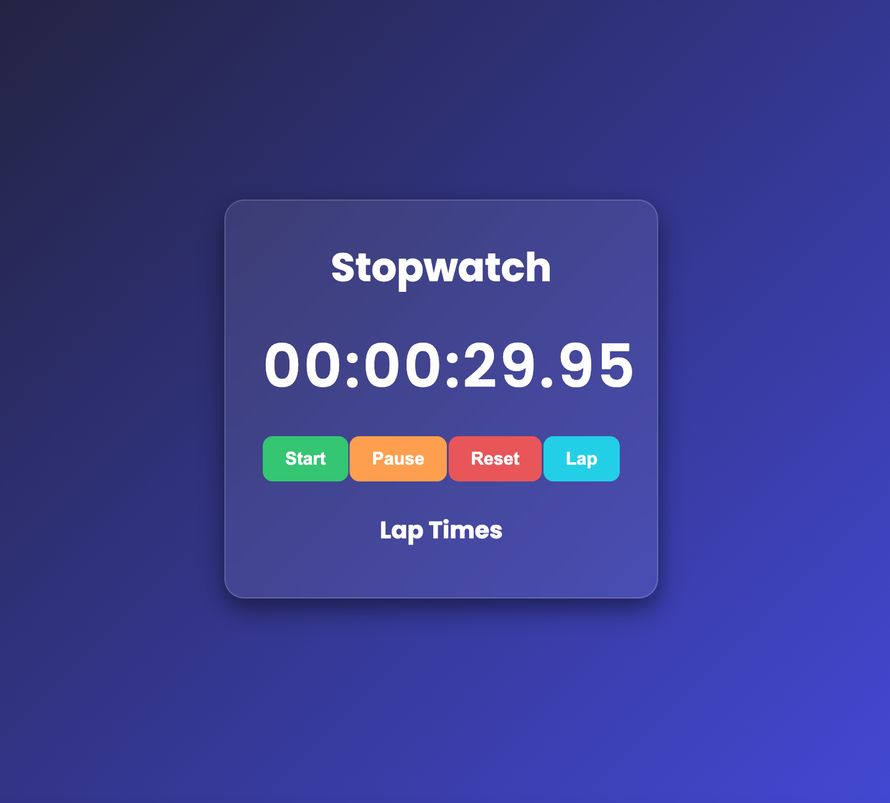

📌 Project Overview

The goal of this project was to build a fully functional stopwatch with a modern front-end design and real-time interactivity.

The stopwatch includes:

A live digital timer displaying hours, minutes, seconds, and centiseconds.

Start, Pause, Reset control buttons.

Lap recording functionality that logs multiple laps.

A scrollable lap list for easy viewing.

A glassmorphism UI with gradients and transparency.

A responsive layout that works smoothly on all screen sizes.

This project focuses on mastering JavaScript timing functions, DOM manipulation, UI/UX styling, and clean code structure.

🛠️ Technologies Used

HTML5 – Structure of the stopwatch interface

CSS3 – Styling, layout, responsiveness, glassmorphism design

JavaScript (ES6+) – Timer logic, event handling, lap recording

✨ Features

▶️ Start Timer — Begins accurate time tracking

⏸️ Pause Timer — Temporarily freezes time

🔄 Reset Stopwatch — Clears everything instantly

📝 Lap Recorder — Saves individual lap timestamps

📜 Scrollable Lap List — View multiple laps with ease

🎨 Modern Glass UI — Smooth blur, transparency & gradients

⚡ Real-Time Updates — High-precision 10ms refresh rate

## 📸 Screenshots

